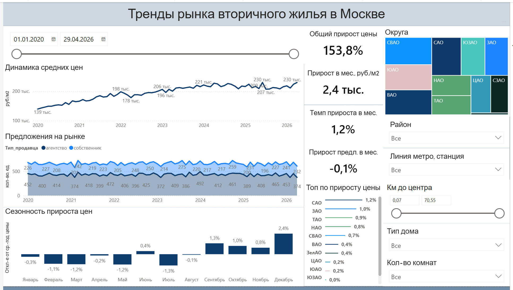
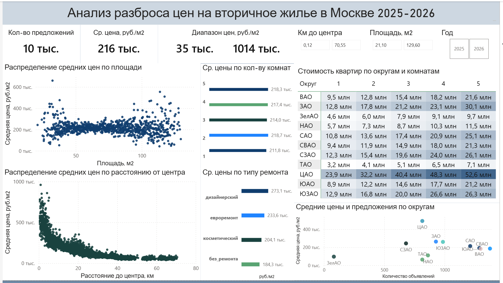
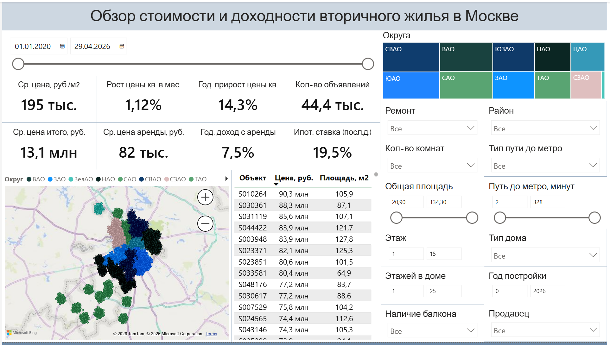

# Moscow_real_estate_dashboard
Power BI dashboard analyzing the Moscow secondary real estate market in 2020-2026: trends, price distribution, and rental yield.

## О проекте

Дашборд разработан для анализа рынка недвижимости вторичного жилья в Москве:
* обзора трендов цен на вторичную недвижимость в Москве в целом и по выбранным параметрам
* анализа ценового разброса цен по ключевым характеристикам объектов недвижимости
* подбора подходящего объекта и оценки его доходности по темпу прироста цены и по потенциальному доходу с аренды

**Основные пользователи:** потенциальные покупатели, риэлторы, инвесторы

**Исходные данные:** использованы csv-файлы датасета [Moscow Real Estate: Sales & Rentals (2020–2026)](https://www.kaggle.com/datasets/sergionefedov/moscow-real-estate-sales-and-rentals-20202026/data), а именно:
* secondary_market.csv
* district_prices_monthly.csv

Таблицы были обработаны в Power Query и объединены в одну методом внешнего соединения слева/LEFT JOIN (добавлен столбец rental_price_per_sqm_monthly из таблицы district_prices_monthly.csv), изменен формат данных и часть данных была локализована под визуализации для отчёта.

Количество записей: 50 000

**Метаданные:**
- id - ИД объявления о продаже
- date_posted - дата публикации объявления
- district - район
- lat - широта расположения объекта
- lon - долгота расположения объекта
- total_area - общая площадь в м²
- rooms - количество комнат
- floor - этаж
- total_floors - общее число этажей в доме
- building_year - год постройки дома
- balcony - наличие балкона
- metro_station - ближайшая станция метро
- metro_line - линия метро
- metro_distance_min - расстояние до метро в минутах
- metro_distance_type - тип расстояния до метро (пешком/на транспорте)
- to_center_km - расстояние до центра в км
- price_rub - цена объекта в рублях
- price_per_sqm - цена в руб. за м²
- mortgage_rate_at_listing - ставка ипотеки в объявлении
- seller_type - тип продавца (собственник/агентство)
- okrug - округ
- building_type - тип постройки (кирпичный/монолитный/панельный/современный панельный/сталинский/хрущевский)
- renovation_type - тип ремонта (без ремонта, дизайнерский, евроремонт, косметический)
- rental_price_per_sqm_monthly - ставка аренды в месяц (руб./м²)

## Стек
Power BI, DAX, Power Query

## Структура дашборда

### Страница 1 - Тренды рынка вторичного жилья в Москве

На странице показаны данные за весь период публикаций, можно выбрать диапазон дат с помощью среза/ползунка сверху справа.
По линейному графику средних цен за м² можно оценить общую динамику изменения цен на вторичное жилье, также представлен график изменения кол-ва публикаций на рынке в разбивке по объявлениям от собственников и агентств.
График сезонности прироста цен демонстрирует, насколько по в среднем отклоняются цены в конкретные месяцы от среднегодовой цены за выбранный период публикаций.
Карточки справа показывают: 
- общий прирост цены за весь период в %;
- среднемесячный прирост цены в руб./м²;
- средний темп прироста цены в мес. в %;
- средний прирост количества предложений в мес. в %
Линейчатый график под карточками показывает топ округов по среднемесячному приросту цены в %
Справа расположены диаграмма дерева округов (размер зависит от кол-ва публикаций в каждом из них), срезы по району, линии и станции метро, расстоянию до центра в км, типу дома (постройки) и кол-ву комнат.
Можно выбрать несколько округов и значений в срезах.

### Страница 2 - Анализ разброса цен на вторичное жилье в Москве 2025-2026

На странице данные доступны за 2025-2026 год (ограничены с помощью заблокированного фильтра по датам публикаций).
По визуализациям на странице можно проанализировать влияние основных параметров на цену за м², а также сопоставить округа по средним ценам и кол-ву предложений, сравнить средние стоимости квартир разной комнатности в каждом из представленных округов.
В карточках представлены средняя цена за м², диапазон цен (минимальная, максимальная), а также количество предложений на рынке.
С помощью срезов справа можно отфильтровать объекты по расстоянию до центра, площади и году публикации (2025, 2026 или в любом из них).
Рассматриваются 2 точечных графика с распределением средних цен в руб./м²:
- в зависимости от общей площади объекта в м² (синий график)
- в зависимости от расстояния до центра в км (зелёный график).
Разброс цен по количеству комнат и по типу ремонта показан с помощью линейчатых диаграмм.
Справа составлена таблица со средними ценами за квартиры в зависимости от округа и количества комнат (форматирование от минимальной цены белого цвета до максимальной синего цвета).
Ниже представлен график средних цен и предложений по округам.

### Страница 3 - Обзор стоимости и доходности вторичного жилья в Москве

Страница разработана для подбора объекта и оценки его потенциальной доходности, доступны данные за весь период (можно выбрать конкретный диапазон по срезу сверху слева).
Основные показатели на 6 карточках:
- Средняя цена в руб./м²
- Средняя цена за объект в руб.
- Среднемесячный рост цены в %
- Средняя цена аренды, руб. в мес.
- Среднегодовой прирост цены в %
- Годовой доход с аренды в %
- Количество объявлений
- Ипотечная ставка на последнюю дату

Ниже представлена карта опубликованных объявлений с цветовой группировкой по округам, а также таблица с ИД объявления, ценой объекта в млн руб. и общей площадью в м².
Справа расположены фильтры:
- диаграмма дерева по округам
- срезы по типу ремонта, кол-ву комнат, общей площади, этажу и кол-ву этажей в доме, наличию балкона
- срезы по району, типу пути до метро и времени пути до метро в минутах, типу дома (постройки), году постройки и типу продавца
Можно выбрать несколько значений для срезов.

## Планируемые обновления
1. Добавление Python-скрипта для предварительной обработки данных и разбивки на таблицы измерений и фактов для создания SQL модели данных и использования sql-запросов для выгрузки данных в Power BI
2. Расчет скользящей средней для сглаживания выбросов на временных рядах и расчет индексов сезонности для обновления графика сезонности по месяцам
3. Обновление мер по мере изучения языка DAX
4. Проведение анализа временных рядов (ARIMA-модели) с целью точечного и интервального прогнозирования цен на недвижимость
5. Проведение корреляционно-регрессионного анализа по данным за 2025-2026 год с целью выявления ключевых факторов цены недвижимости и оценки степени их влияния на неё
